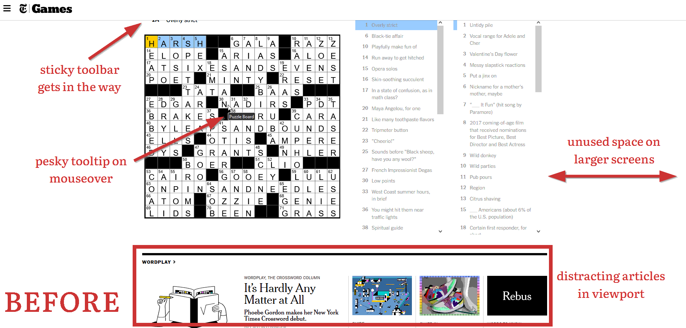
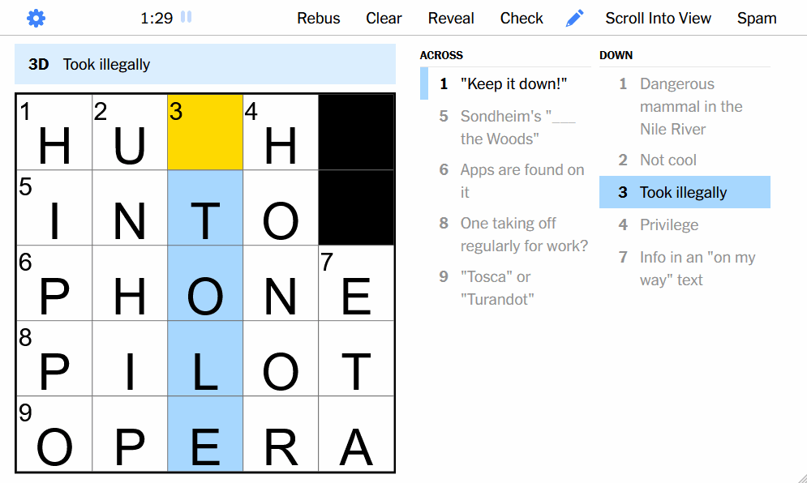

# Crosseyed

  

A browser extension that offers various (subjective!) improvements for the NYT Crossword website.

- Resizes the puzzle to use all of your viewport.
- Automatically scrolls your viewport to the puzzle when you start the puzzle.
- Add new menu buttons:
  - "Spam": Brute forces all letters, A to Z, on the currently selected cell. Helpful for solving
    the last cell of a puzzle.
  - "Scroll into View": Scrolls your viewport to the puzzle.
- Responsively increases font size for larger screens
- Removes an annoying tooltip that blocks the puzzle when mousing-.over it.

## Spam Feature

  

This feature is helpful if you're at the end of the puzzle, but have just one or two open cells left
that you can't quite get (obscure trivia, etc). With the Spam feature, Crosseyed will iterate
through all letters on the selected cell in mere seconds. One of them will eventually be right!

You may call it cheaty... I don't. This just saves me time for how I work a crossword in this
specific case.

## Known Issues

- Content below the puzzle may be overflowed onto at small screen heights
